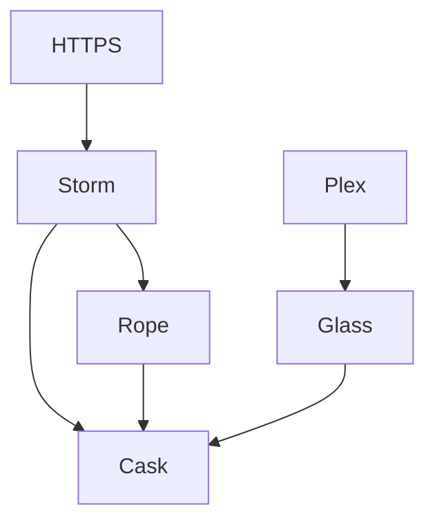

---

id: 745
datetime: "2024-10-03T10:30:00-0500"
title: "Homelab 2024"
draft: true
permalink: "/post/745"

---

In my home, there is a pile of servers. It didn't used to be this big or complicated, but since buying a home, my situation has changed. I have more space, cheaper electricity, and better internet. 

The above is a rough diagram of the network of these systems.

## Glass

Glass is the newest and most powerful of the servers. It's a [MINISFORUM NPB6](https://amzn.to/3zQffXk). The main reason I got this was for the i7-13620H CPU, as it has great benchmarks with Plex and is relatively affordable.

Glass has an NFSv4 mount of Cask, and serves content to Plex users remotely.

## Rope

## Storm

## Cask