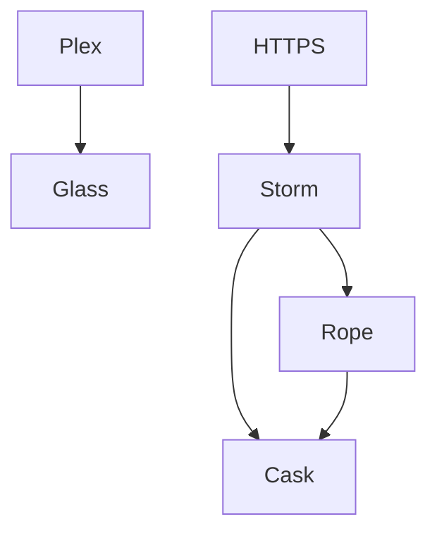

---

id: 745
datetime: "2024-10-03T10:30:00-0500"
title: "Homelab 2024"
draft: true
permalink: "/post/745"

---

In my home, there is a pile of servers. It didn't used to be this big or complicated, but since buying a home, my situation has changed. I have more space, cheaper electricity, and better internet. 



```
                    │                        │
                    │                        │
                    │  Plex                  │ HTTP + SSH
                    │                        │
                    │                        │
┌───────────────────┼────────────────────────┼─────────────────────────────────────────────────┐
│                   │                        │                                                 │
│                   │                        │                                                 │
│                   │                        │                                                 │
│                   │                        ▼                                                 │
│                   │              ┌─────────────────┐                                         │
│                   │              │                 │                                         │
│                   │              │    NUC 3        │                                         │
│                   ▼              │                 │                                         │
│             ┌──────────────┐     │    - Caddy2     │                                         │
│             │              │     │    - Websites   │                                         │
│             │     NUC 1    │     │                 │                                         │
│             │              │     │                 │                                         │
│             │     Plex     │     └─────────────────┘           ┌──────────────────────┐      │
│             │              │          ▲                        │                      │      │
│             └──────────────┘          │                        │       NUC 2          │      │
│                    ▲                  │                        │                      │      │
│                    │                  │                        │    Docker Compose    │      │
│                    │ NFS              │ NFS                    │    - Sonarr          │      │
│                    │                  │                        │    - Radarr          │      │
│                    │                  │                        │    - Lidarr          │      │
│                    │                  │                        │    - Readarr         │      │
│            ┌───────┴───────┐          │                        │    - Notifiarr       │      │
│            │               ├──────────┘                        │    - Prowlarr        │      │
│            │               │                                   │    - Sabnzbd         │      │
│            │   QNAP NAS    ├──────────────────────────────────►│                      │      │
│            │               │             NFS                   └──────────────────────┘      │
│            │               │                                                                 │
│            │               │                                                                 │
│            │               │                                                                 │
│            └───────────────┘                                                                 │
│                                                                                              │
│                                                                                              │
└──────────────────────────────────────────────────────────────────────────────────────────────┘
```

[Source](https://asciiflow.com/#/share/eJztls9PwjAUx%2F%2BVplch0QkmciMYw4Esk%2BGtl%2BJqsgirGURBQmI8e%2BCwEA7%2BFcaT4a%2FZX%2BImUX61o%2B1WJELTZGu7vs%2B377WvG0APtwkswSptkxpuAuPYKMAcbOE%2B8aPuAYIPxO%2B41EOwZOQQ7EXP82IheuvHPWfF6K1Let2ogSCQKWHwIvX9QkHI2x9UgsV4qNpoWOAI2HY1K5jVIj05HSlgnJIOFgavYfCsWqcp5uozpbWOvp3GcrmWGEUzD8DdAI6n2wCqHsiRXlHrn8kHQAVpXlfAqSbkakB1rlIyrKNFeB5UsOP0jYwFcWKs1wuzdhzVk21D1zr%2BLfT3t2QODZSSymTJeJo%2FBXaekvTdrDF%2BT%2FCK0AAPK%2BWkCdc8mxzveUNS0s8ga8kqd6MUlNW9o9ALenNHfFCh7XvaISpQ89IW6FyC5oFNPez7XKE6VpoHdexsH1pz%2FwBaJ8tLFYHys9TH5oQkIsqkXffWncsSE7VqNwzeZHIvW4rl08fWgoNUpYhcPvM9j5veU9PhTU%2BAXpllC5hlW3D9GdXxZ6rEtNlf7CSheuMmbYJMAypS9hYoGzvuWc1Cjq5ygB1gQrBMMtn%2B1AmCQzj8AjzG%2FEg%3D)

The above is a rough diagram of the network of these systems.

## NUC 1 (Glass)


## NUC 2 (Rope)


## NUC 3 (Storm)


## QNAP NAS