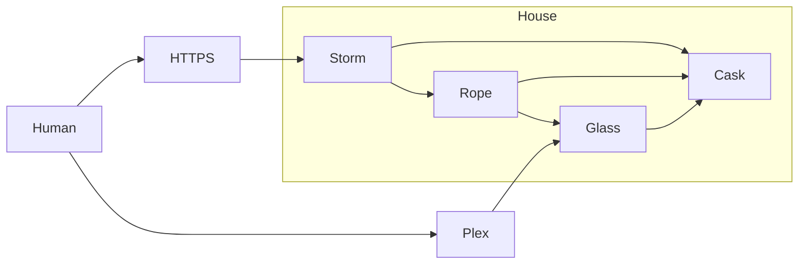

---

id: 745
datetime: "2024-10-22T10:30:00-0500"
title: "Homelab 2024"
draft: false
permalink: "/post/745"

---

In my home, there is a pile of servers. It didn't used to be this big or complicated, but since buying a home in 2020, my situation has changed. I have more space, cheaper electricity, and better internet. I used to run everything off of a single Synology box. But with space and time comes growth. So let us talk a bit about #infrastructure!

[](https://icco.imgix.net/photos/2024/0HN0R3JPV7MQS.jpg)


The above is a rough diagram of the network of these systems.

## Glass

Glass is the newest and most powerful of the servers. It's a [MINISFORUM NPB6](https://amzn.to/3zQffXk). The main reason I got this was for the i7-13620H CPU, as it has great benchmarks with Plex and is relatively affordable.

Glass has an NFSv4 mount of Cask, and serves content to Plex users remotely. It doesn't do much else, but works great.

[](https://icco.imgix.net/photos/2024/0HGACVZTN3J7P.png)

## Rope

Rope is the second newest. It is a NUC10, and runs internal services. It runs things like the [Servarr](https://wiki.servarr.com/) family of services, various crons, and other random things. Everything is managed by `docker compose` and many of the services have file mounts over NFSv4.

[](https://icco.imgix.net/photos/2024/0HGACWRZH3G8S.png)

## Storm

[](https://icco.imgix.net/photos/2024/0HGACXHAX3KYW.png)

Storm serves this website, and most other domains that I personally host. I used to host all of these on GCP, but it was costing me a lot of money, so I moved them home. Storm runs a Caddy server. This is customized with a few plugins, the most interesting is [caddy-docker-proxy](https://github.com/lucaslorentz/caddy-docker-proxy/). You can see my configuration at [icco/caddy-home](https://github.com/icco/caddy-home/tree/main). It looks at the running services in docker compose, and gets them lets encrypt certificates and configures Caddy to serve them.

An example configuration in docker compose that I use is:

```yaml
services:
  # ...
  writing:
    image: ghcr.io/icco/writing:main
    restart: unless-stopped
    logging:
      driver: json-file
    networks:
      - caddy
    environment:
    labels:
      caddy: writing.natwelch.com
      caddy.reverse_proxy: '{{upstreams 8080}}'
```

## Cask

Cask is a QNAP NAS. It's not using any special configuration beyond having NFSv4, SMB and AFP enabled. It has one SSD, and the other eleven disks are spinning disks. I use this server mostly for backups and general data hoarding. The spinning disks are 20TB drives from varying manufactures.

## Networking

Anyways, that's the rough setup of my homelab. Everything is connected with ethernet through a Unifi controller, which has some security cameras, some Raspberry Pis, and some wifi access points connected. At some point I'll write a more indepth writeup of the Pis, as those are each posts in themselves for random projects I've done.

I hope you found this interesting.

/Nat
