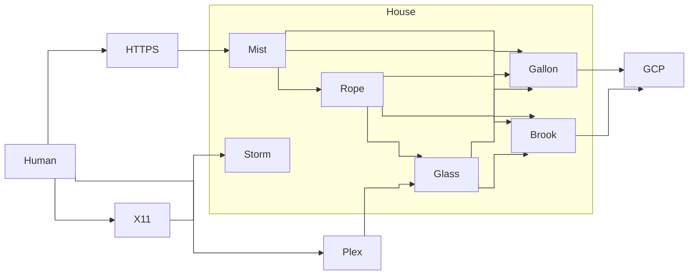

---

id: 759
datetime: "2025-04-13T05:19:18+0000"
title: "Homelab Updates"
draft: true
permalink: "/post/759"

---

Well. I had some hard drive and RAM failures. And by some, I mean a lot.

First, some context. See [my previous post on my Homelab](https://writing.natwelch.com/post/745) for what the system was before this month. It hadn't had too many changes in the last few years. The only big change was adding Glass to split the workload that Storm was doing, and moving most of my websites from Google Cloud to Storm.

But, over the last few months:

 - Gallon had its RAM fail, and two separate hard drive failures.
 - Storm had a hard drive fail.
 - I ran out of space on Gallon.

So I put some investment into fixing things.

