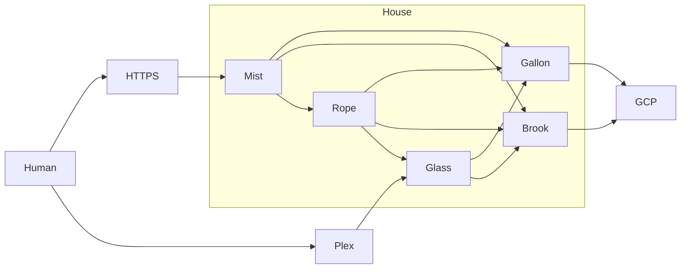

---

id: 759
datetime: "2025-04-26T20:47:18-0500"
title: "Postmortem & Homelab Updates"
draft: false
permalink: "/post/759"

---

Well. I had some hard drive and RAM failures. And by some, I mean a lot.

First, some context. See [my previous post on my Homelab](https://writing.natwelch.com/post/745) for what the system was before this month. It hadn't had too many changes in the last few years. The only big change was adding Glass to split the workload that Storm was doing, and moving most of my websites from Google Cloud to Storm.

But, over the last few months:

 - Gallon had its RAM fail, and two separate hard drive failures.
 - Storm had a hard drive fail.
 - I ran out of space on Gallon.

So I put some investment into fixing things.

Rope and Glass have no changes in this update. Lets walk through how the other three servers have changed.

## Gallon & Brook

The first failure was a RAM failure on Gallon. It had a 16GB single RAM stick in it. Thankfully I had the original 4GB stick that the QNAP came with, so I was able to swap that in and get the server back up and running. I then ordered a new 16GB stick, and put that in.

As for the drive failure, that was less easy. I did a stupid thing when I setup Gallon. I put a 2TB SSD in slot 0, and used it for the OS. That part was fine, but I also included it in the storage pool, which was the issue. For QNAP, that means that the storage pool has two vdisks:

1. A single 2TB SSD
2. 11 20TB HDD in Raid 5

If one drive fails in #2, it doesn't matter. I put in a new drive, rebuild the raid, and everything is copasetic. If the SSD drive fails, the whole storage pool is gone.

So, of course, the SSD failed.

Talking to QNAP support was helpful, but it was pretty clear that because I did this configuration poorly (aka completely wrong), I was basically fucked.

Support helped me get the system into Read Only mode, but basically said backup the data as fast as possible, as the SSD could completely fail at any time, and there's no way to rebuild or replace that SSD without deleting everything.

So I decided to backup everything except for one folder which contained my archive of TV shows. I knew I could rebuild this from other sources, and it was so large (~120TB), I could never back it up in a reasonable amount of time.

So first I backed up things that were uber important to GCP (about 4TB), and then came up with a plan for the remaining 60TB.

After a lot of research, I picked up a refurbished Dell R730xd from [TechMikeNY](https://techmikeny.com/). I originally found them on Craigslist, but got a better deal buying directly from their website. They kindly shipped it to me for free.

I named this new NAS brook.

I had 13 10TB drives in various states of health in my basement, so I started working on getting them into the R730xd.

Some things I learned while setting up the R730xd:

- Most NAS software these days tells you not to use Hardware Raid. Partially because they are apparently a common failure point, and partially because they often don't have open source drivers for reading state data off of them.
- This R730xd didn't have a backplane, so I had to buy one aftermarket to add extra operating system drives (which I wanted in RAID 1). Sadly I bought two 2TB HDD off of Amazon and one was DOA. I returned it to Amazon, and for now the OS is on a single disk :facepalm:.
- I spent a bunch of time investigating different operating systems. I was looking for something that would let me use the RX730 as a NAS.
  - [Home Media Server Operating System](https://www.richarddavidjones.com/beginner-nas-operating-system/) has a good overview of the different options.
  - I first went with [OpenMediaVault](https://www.openmediavault.org/) for the OS. It was pretty easy to install. But drive and storage management was a pain.
  - Next, I went to [TrueNAS](https://www.truenas.com/). I could not get this to boot following their directions.
  - I was going to try [UnRAID](https://unraid.net/), but was annoyed at the idea of paying a subscription for my OS, so decided to skip it.
  - I ended up with OMV and the OMV ZFS extension, which allowed for ZFS and thus solved the drive management issues.

As for recovering Gallon, my QNAP server, things I read and learned from:

- [Surviving QNAP RAID failure](https://travenec.cz/surviving-qnap-raid-failure/) talks about the proprietary software for working with QNAP.
- [openmediavault-zfs](https://github.com/OpenMediaVault-Plugin-Developers/openmediavault-zfs)
- [RClone SFTP Settings](https://rclone.org/sftp/)

Using RClone to copy everything to GCP and Brook I wanted to was ~65TB. The entire process to replicate data took six days.

I then deleted everything on Gallon, took out the SSD, replaced it with a normal 20TB HDD and rebuilt the system as two six disk RAID5s. This was the recommendation of QNAP support over a single 12 disk RAID6. I do not know why, but followed their advice.

I am now slowly re-archiving the TV content I had. I imagine that will take a long time. But that was the only thing lost for now, and everything in the storage realm is backup and serving.

## Storm & Mist

Storm had a hard drive failure. This drive was an external drive, which is still readable, but not writable. This server is also very old (~12y), so I decided to just replace it with a new server. I got another server similar to Glass, but used. I named this server Mist.

I moved all of the data from Storm to Mist and configured it with just what it needed. It is serving all of my websites and databases, and is now also backed up, which it was not before.

I have yet to do this, but I plan on wiping Storm, recycling the external drives, and set it up as a desktop computer. I haven't had a desktop Linux machine in a while, and am excited to have it setup again. I am keeping it in its current state for a few more weeks in case I discover I need something that is not backed up correctly. I've already had a few occurrences where that's been the case.

Hope you enjoyed this little postmortem on my home storage setup. Things are mostly running along smoothly now. Backup your data folks, hardware failure happens.

/Nat
