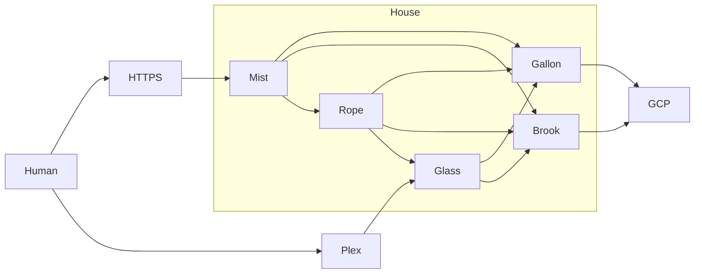

---

id: 759
datetime: "2025-04-13T05:19:18+0000"
title: "Homelab Updates"
draft: true
permalink: "/post/759"

---

Well. I had some hard drive and RAM failures. And by some, I mean a lot.

First, some context. See [my previous post on my Homelab](https://writing.natwelch.com/post/745) for what the system was before this month. It hadn't had too many changes in the last few years. The only big change was adding Glass to split the workload that Storm was doing, and moving most of my websites from Google Cloud to Storm.

But, over the last few months:

 - Gallon had its RAM fail, and two separate hard drive failures.
 - Storm had a hard drive fail.
 - I ran out of space on Gallon.

So I put some investment into fixing things.

Rope and Glass have no changes in this update. Lets walk through how the other three servers have changed.

## Gallon & Brook

The first failure was a RAM failure on Gallon. It had a 16GB single RAM stick in it. Thankfully I had the original 4GB stick that the QNAP came with, so I was able to swap that in and get the server back up and running. I then ordered a new 16GB stick, and put that in.

As for the drive failure, that was less easy. I did a stupid thing when I setup Gallon. I put an SSD in slot 0, and used it for the OS. That part was fine, but I also included it in the Raid pool, which was the issue. So when the SSD failed, I lost the OS and the Raid pool. Talking to QNAP support was helpful, but it was pretty clear that because I did this configuration poorly, I was basically fucked.

While I was working with them to recover the data, I picked up a used Dell RX730 off of craigslist. My theory is at some point is I'd get Gallon into a read-only state, and get some or all of the data off of it. I had 13 10TB drives in various states of health in my basement, so I started working on getting them into the RX730.

Some things I learned while setting up the RX730:

- Most NAS software these days tells you not to use Hardware Raid. Partially because they are apparently a common failure point, and partially because they often don't have open source drivers for reading state data off of them.
- This RX730 didn't have a backplane, so I had to buy one aftermarket to add extra operating system drives (which I wanted in RAID 1).
- I spent a bunch of time investigating different operating systems. I was looking for something that would let me use the RX730 as a NAS.
  - [Home Media Server Operating System](https://www.richarddavidjones.com/beginner-nas-operating-system/) has a good overview of the different options. 
  - I first went with [OpenMediaVault](https://www.openmediavault.org/) for the OS. It was pretty easy to install. But drive and storage management was a pain.
  - Next, I went to [TrueNAS](https://www.truenas.com/).

As for recovering my Gallon, my QNAP server, things I read and learned from:

- [Surviving QNAP RAID failure](https://travenec.cz/surviving-qnap-raid-failure/) talks about the proprietary software for working with QNAP.

## Storm & Mist

Storm had a hard drive failure. This drive was an external drive, which is still readable, but not writable. This server is also very old, so I decided to just replace it with a new server. I got another server similar to Glass, but used. 

I moved all of the data from Storm to Mist and configured it with just what it needed.

I then wiped Storm, recycled the external drives, and set it up as a desktop computer. I haven't had a desktop Linux machine in a while, and am excited to have it setup again.
